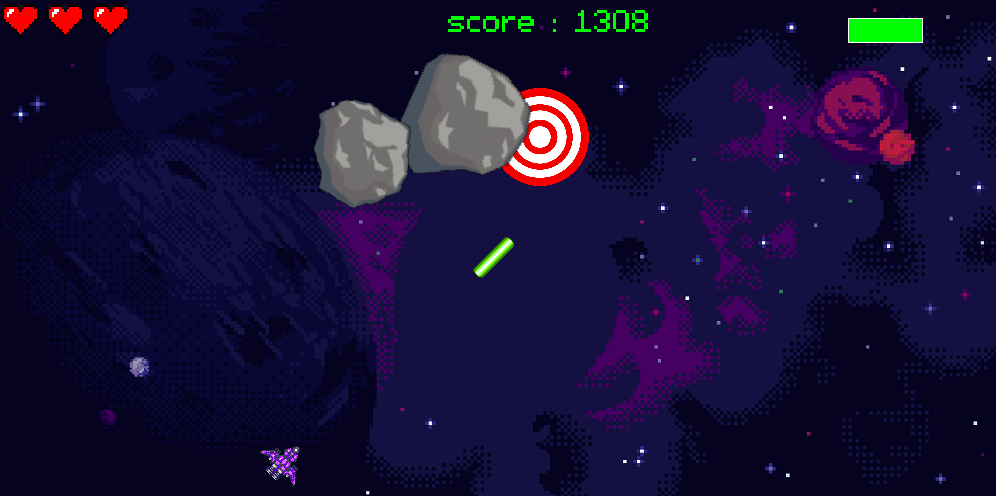
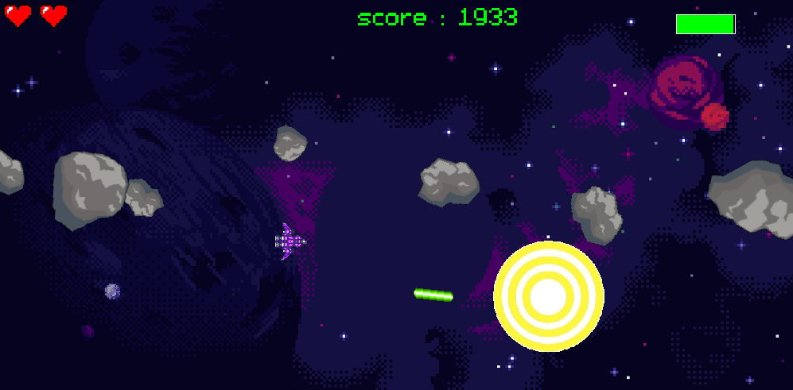

# Target-ocaml-edition
You control a ship in an asteroid field and you must destroy all target you see at all cost !!!
But beware, the asteroid wont give you any mercy and wont hesitate to block your way !!!

To be honest... I don't really want to do some procedural generation to assure a survival way in OCaml. 

# Requirements
Since this game was made in [OCaml](https://ocaml.org/), you need to install it to run this game.
For that, I highly recommend you to use [opam](https://opam.ocaml.org/). That will make your OCaml life less a burden.
And finaly, after that you have configure opam, you can download [Tsdl](https://ocaml.org/p/tsdl/latest/CHANGES.md.html), which is a bind of [SDL](https://www.libsdl.org/) in OCaml.
First make sure opam is up to date : 
```
opam upgrade
```
or
```
opam update
```
Then, you can install Tsdl and the others accompagned libs with the command :

```
opam install tsdl tsld-image tsdl-mixer tsdl-ttf
```
ps : you need to have SDL (and all accompagned libs image mixer ttf ...) installed for Tsdl to work.

# Build / Install
First clone the repo :
```
git clone https://github.com/idimension18/Target-ocaml-edition
```
then, on the root of the project, just run :
```
make
```
If all has gone well, a binary should have appeared in the bin folder.

If you want to clean the repo you can run :
```
make clean
```

# How to play ?
This game only support game controller (yep, keyboard wont work)
The controls are :
- Button A to fire lasers (that destroy targets)
- The analogic pad to control the direction (the ship will point to the direction of the pad)
- And Right Trigger to turn on the engine ! (ps : since you're in space, think about the consequences of your actions)

# Cool screenshots 
<p align="center">
  
  
</p>

# Licence
Do whatever you do with this game :) I don't own nothing.

